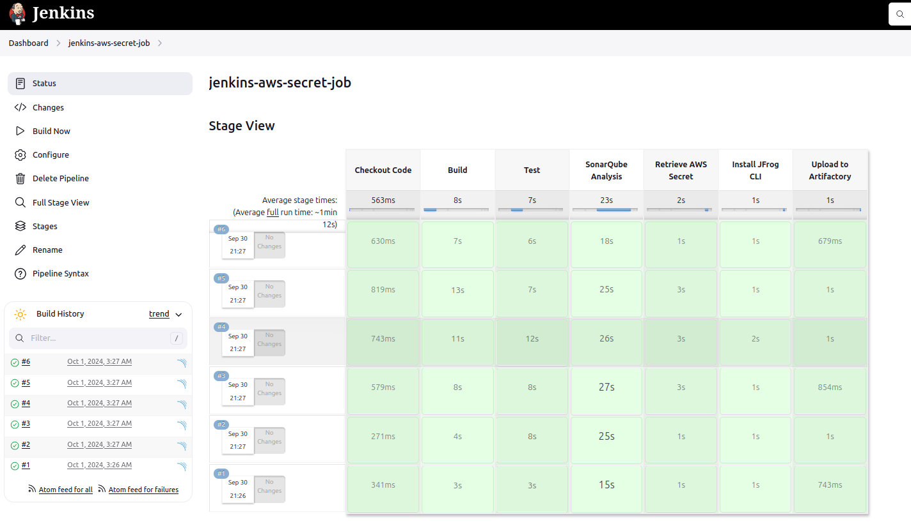
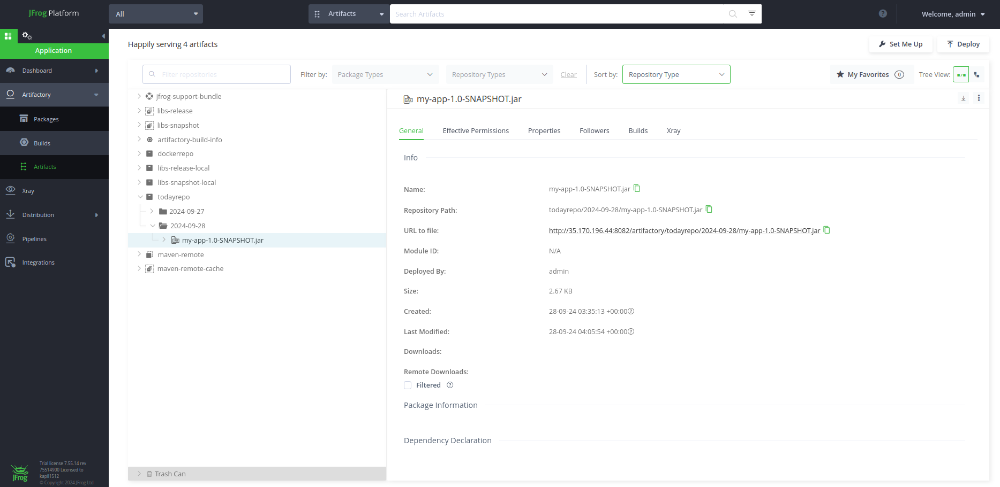
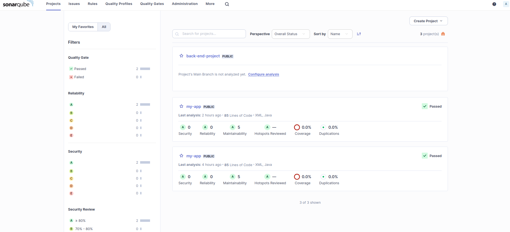

# CI Pipeline with Jenkins, SonarQube, and JFrog Artifactory

This project demonstrates how to set up and integrate a CI/CD pipeline using Jenkins, SonarQube, and JFrog Artifactory for software development and testing on AWS EC2 instances.

# Technologies Used

1. AWS EC2: Infrastructure hosting the CI/CD tools.
2. Ubuntu: OS used for instances.
3. Jenkins: Automation server for CI/CD pipeline.
4. SonarQube: Tool for code quality analysis.
5. JFrog Artifactory: Universal binary repository manager.

# Project Overview

1. Setup JFrog Artifactory and SonarQube on an EC2 Ubuntu instance (t3.xlarge) - 1st EC2
    
    1.1 We will install and configure JFrog Artifactory on a dedicated EC2 instance.

2. Setup JFrog Artifactory and SonarQube on an EC2 Ubuntu instance (t3.xlarge) - 2nd EC2

    1.1 We will install and configure SonarQube on a dedicated EC2 instance.

3. Pipeline Integration
    
    1.1 Integrate Jenkins with JFrog and SonarQube for an end-to-end CI pipeline.

# Jfrog Artifactory SetUp
## Steps to Set Up JFrog Artifactory on an EC2 Ubuntu Instance
## Prerequisites

> Ensure you have an Ubuntu EC2 instance running (t3.xlarge is recommended for this setup).
    You should have SSH access to the instance.

## Installation Instructions

Step 1: SSH into the EC2 Instance

Step 2: Use the following command to SSH into your Ubuntu EC2 instance,

   ```
   ssh -i "your-key.pem" ubuntu@your-instance-public-ip

   # Allow inbound traffic port 22, 8081 and 8082 from your IP 
   ```
#### _Important Note on EC2 Configuration_

When setting up Jenkins on an EC2 instance, it is highly recommended to associate an **Elastic IP** with the instance. 

By default, the public IP of your EC2 instance changes every time the instance is stopped and started. If you don't use an Elastic IP, you'll need to update the Jenkins URL in **Jenkins > Manage Jenkins > Configure System > Jenkins URL** every time, which can cause Jenkins to behave slowly or cause connectivity issues.

To avoid this, allocate an Elastic IP in AWS and associate it with your EC2 instance, ensuring that your Jenkins instance always remains accessible at the same IP address.


Step 3: Install Java

   * JFrog Artifactory requires Java to run. Use the following commands to install OpenJDK 11,

     ```
     sudo apt update
     sudo apt install openjdk-11-jre -y
     ```

Step 4: Download and Extract JFrog Artifactory

   * Download the latest version of JFrog Artifactory from the official release repository,

     ```
     sudo su
     
     wget https://releases.jfrog.io/artifactory/artifactory-pro/org/artifactory/pro/jfrog-artifactory-pro/7.55.14/jfrog-artifactory-pro-7.55.14-linux.tar.gz
     
     tar -xvzf jfrog-artifactory-pro-7.55.14-linux.tar.gz
     ```

Step 5: Navigate into the Extracted Directory

     ```
     cd artifactory-pro-7.55.14/
     cd app/bin/
     ```

Step 6: Install JFrog Artifactory as a Service
   
   * To install JFrog Artifactory as a service, run the installation script,
    
     ```
     ./installService.sh
     ```

Step 7: Install net-tools package:

   * Run the following command to install the missing net-tools package:

     ```
     sudo apt update
     sudo apt-get install net-tools
     ```

Step 8: Configure Firewall Rules

   * Ensure the necessary ports are open for JFrog Artifactory,

     ```
     ufw allow 8081
     ufw allow 8082
     ```
Step 9: Start and Check Artifactory Service

   * Start the Artifactory service using the systemctl command,
     
     ```
     systemctl start artifactory.service
     ```

Step 10: Access JFrog Artifactory

   * Start the Xray service:

     ```
     sudo systemctl start xray.service
     ```

Step 11: Access JFrog Artifactory

   * Once the service is up and running, JFrog Artifactory will be accessible via the following ports,

     ```
     8081: Artifactory
     8082: API Access

     # You can access the JFrog Artifactory UI by navigating to http://<server-ip>:8081.
     ```

# JFrog Artifactory UI Setup
After successfully installing and starting JFrog Artifactory, follow these steps to configure your local repository using the JFrog UI.

Step 1: Access JFrog Artifactory
 
   * Open your browser and navigate to the JFrog Artifactory UI,

   ```
   http://<server-ip>:8081

   # Log in using the default credentials or your configured admin account
   ```
    
Step 2: Create a Local Maven Repository

   * Once logged in, follow these steps to create a local repository for Maven artifacts:

    1.1 In the top menu, click on Administration.
    1.2 In the left sidebar, select Repositories.
    1.3 Click on Add Repository and choose Local Repository from the options.
    1.4 Select Maven as the Package Type.
    1.5 In the Repository Key field, enter an identifier or name for your repository (e.g., maven-local).
    1.6 Review any other configuration options you may want to adjust.
    1.7 Click Create to set up your local Maven repository.

Step 3: View Artifacts and Binaries
   
   * To view the artifacts and binaries uploaded to your repository:

    1.1 Go to the Application section in the JFrog UI.
    1.2 Navigate to Artifactory > Artifacts.
    1.3 Here, you'll be able to see all the artifacts and binaries stored in your newly created local Maven repository.

# SonarQube Setup

   * After setting up JFrog Artifactory, we will now install and configure SonarQube on the same EC2 instance to perform code quality analysis.

## Prerequisites

    1.1 Java Runtime Environment (JRE) 11 installed.
    1.2 A non-root user to run SonarQube, as Elasticsearch (used by SonarQube) cannot run with root privileges.

## Installation Steps

Step 1: Download SonarQube Community Edition

   * To install SonarQube, download the latest version from the official SonarSource website:

   ```
   cd /opt
   wget https://binaries.sonarsource.com/Distribution/sonarqube/sonarqube-x.x.zip

   # Replace x.x with the latest version available from the SonarQube download page.
   ```

Step 2: Extract the Package

   * Unzip the downloaded SonarQube package:

   ```
   unzip /opt/sonarqube-x.x.zip
   ```

Step 3: Change Ownership

   * Before starting the SonarQube service, change the ownership of the SonarQube directory to a non-root user (this user should be created if it doesn’t exist):

   ```
   chown -R <sonar_user>:<sonar_user_group> /opt/sonarqube-x.x

   # Replace <sonar_user> and <sonar_user_group> with the actual user and group you will use to manage SonarQube.
   ```

Step 4: Modify Configuration (Optional)

   * If you need to modify default settings, such as database configuration or web port, edit the sonar.properties file:

   ```
   cd /opt/sonarqube-x.x/conf
   nano sonar.properties
   ```

   Key configurations you might want to adjust:
    
   ``` 
    Database Settings: sonar.jdbc.username, sonar.jdbc.password
    Web Port: sonar.web.port=9000 (change this if you need a different port)
   ```

Step 5: Start SonarQube Service

   * Navigate to the Linux binaries directory and start the SonarQube service:

   ```
   cd /opt/sonarqube-x.x/bin/linux-x86-64
   ./sonar.sh start
   ```

   * Note: If you attempt to start SonarQube as the root user, it will fail due to Elasticsearch restrictions.

   * If you encounter an error related to running SonarQube as the root user, refer to the next section to create a non-root user.

Step 6: Create Non-Root User and Start Service

   * To resolve the "cannot run Elasticsearch as root" error, create a non-root user and give it ownership of the SonarQube directory:

   ```
   sudo su -
   useradd sonaradmin
   chown -R sonaradmin:sonaradmin /opt/sonarqube
   
   # Switch to the newly created user and start SonarQube:
   ```
   ```
   sudo su - sonaradmin
   cd /opt/sonarqube/bin/linux-x86-64
   ./sonar.sh start
   ./sonar.sh status
   ```
   
Step 7: Open SonarQube Port in Security Group

   * Ensure that port 9000 is open in the EC2 instance's security group to allow access to the SonarQube web interface.

   ```
   sudo ufw allow 9000
   ```

Step 8: Access SonarQube in Browser

   * Once the service is running, you can access SonarQube via a web browser at,
 
   ```
   http://<Public-IP>:9000
   ```

Step 9: Generate Token for Jenkins Integration

   * To integrate SonarQube with Jenkins, follow these steps to generate a token in the SonarQube UI:

        
         1.1 Go to Administration > Security > Users.
         1.2 Click on Tokens and generate a new token.
         1.3 Save this token as it will be used to authenticate Jenkins with SonarQube for code quality analysis.

     * You will need this token when configuring SonarQube integration in Jenkins.

# Jenkins Setup and Configuration with SonarQube and JFrog Artifactory

  > Install Jenkins, configure it with SonarQube and JFrog Artifactory, and set up a Jenkins pipeline to build a  Maven project, perform static code analysis, and upload the artifacts to Artifactory.

Step 1: Install Jenkins

   * To install Jenkins on your EC2 instance, run the following commands,

   ```
   sudo apt update
   sudo apt install openjdk-11-jre -y
   wget -q -O - https://pkg.jenkins.io/debian/jenkins.io.key | sudo apt-key add -
   sudo sh -c 'echo deb http://pkg.jenkins.io/debian-stable binary/ > /etc/apt/sources.list.d/jenkins.list'
   sudo apt update
   sudo apt install jenkins -y
   sudo systemctl start jenkins
   sudo systemctl enable jenkins

   sudo usemod -aG docker $USER
   id docker
   cat /etc/group

   reboot
   ```

Step 2: Install and Configure Maven

   * Jenkins requires Maven to build Java projects. Install Maven using the following commands,

   ```
   cd /opt
   sudo wget https://dlcdn.apache.org/maven/maven-3/3.9.9/binaries/apache-maven-3.9.9-bin.tar.gz
   tar -xvzf <.....>
   mv <.......> maven
   ls
   ```

   * For maven we should set up 2 variables named "M2_HOME" and "M2". Setup M2_HOME and M2 paths in .bash_profile of the user and add these to the path variable

   ```
   vi ~/.bash_profile
   M2_HOME=/opt/maven/apache-maven-3.6.1
   M2=$M2_HOME/bin
   PATH=$PATH:$M2_HOME:$M2
   ```
Step 3: Access the Jenkins Web UI

   * Once Jenkins is installed, open a browser and access the Jenkins UI:

   ```
   http://<Public-IP>:8080
   ```
   * Enter the initial admin password, which can be found by running the following command:

   ```
   sudo cat /var/lib/jenkins/secrets/initialAdminPassword
   ```
Step 4: Install Required Jenkins Plugins

   * In the Jenkins UI, go to Manage Jenkins > Manage Plugins and install the following plugins:

    1.1 SonarQube Scanner for Jenkins
    1.2 Sonar Quality Gates Plugin
    1.3 Artifactory Plugin
    1.4 JFrog Plugin
    1.5 Maven Integration Plugin
    1.6 Maven Invoker Plugin
    1.7 GitHub Integration Plugin
    1.8 All suggested plugins

Step 5: Configure Maven in Jenkins

   * To configure Maven in Jenkins:

    1.1 Go to Manage Jenkins > Global Tool Configuration.
    1.2 Under Maven Installations, click Add Maven and set M2_HOME to /opt/maven.

Step 6: Configure SonarQube in Jenkins

    1.1 Go to Manage Jenkins > Global Tool Configuration.
    1.2 Under SonarQube Scanner, click Add SonarQube Scanner and check the box to Install automatically.
    1.3 Go to Manage Jenkins > Configure System.
    1.4 Under SonarQube Servers, add a new SonarQube installation:
        Server URL: http://<Public-IP>:9000
        Server Authentication Token: Use the token you generated in the SonarQube UI.

Step 7: Create a Pipeline Job in Jenkins

    1.1 In Jenkins, create a new Pipeline Job.
    1.2 Under the Pipeline section, use the following settings:

   
   
Step 8: Configure Credentials

   * In Jenkins, go to Manage Jenkins > Credentials and configure the following credentials:

    1.1 Artifactory Credentials: Add a username and password for your JFrog Artifactory account.
    1.2 SonarQube Credentials: Add the token generated in SonarQube as the sonar_auth_token.


Step 9: Build the Pipeline

   * Trigger the build of the pipeline job you created. The build will:

    1.1 Pull the code from the GitHub repository.
    1.2 Build the code using Maven.
    1.3 Run unit tests.
    1.4 Perform static code analysis using SonarQube.
    1.5 Upload/Deploy the built artifact to JFrog Artifactory.
    1.6 Clean the Jenkins workspace.

Step 10: Verify Results

    1.1 SonarQube: Go to your SonarQube server and check the results of the static code analysis.
    1.2 JFrog Artifactory: Verify that the artifact has been uploaded to the specified Maven repository in Artifactory.







